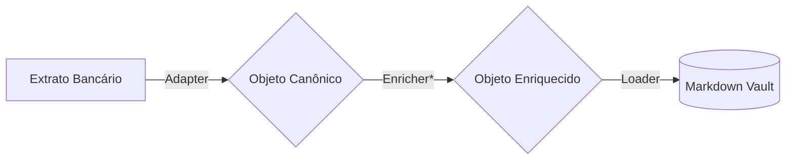

# Finance Vault 🏦

> **"File over App"**: Sua vida financeira em texto plano, auditável e sob seu controle.

[](LICENSE)

O **Finance Vault** é um ecossistema de ferramentas modulares projetado para ingerir, processar e armazenar transações financeiras em notas Markdown (Obsidian) com frontmatter estruturado. Ele segue a **Filosofia Unix**: cada componente faz uma única coisa bem feita, conectados por pipelines.

## 🌟 Destaques

- **Soberania de Dados**: Nada de bancos de dados proprietários ou APIs fechadas. Seus dados são arquivos.
- **Transacional e Seguro**: Utiliza [Loam](https://github.com/aretw0/loam) como engine de armazenamento (Git + Markdown).
- **Agnóstico**: Scripts adaptadores convertem CSV/OFX/PDF de qualquer banco para um formato canônico.
- **Multi-Tenant**: Suporte nativo para múltiplos usuários (ex: casal) e múltiplos contextos (ex: pessoal, empresa) no mesmo cofre.
- **Pipeline-Driven**: Automação via CLI. `cat extrato.csv | adapter | loader`.

## 🛠️ Arquitetura

O sistema opera em um fluxo linear:



*Para mais detalhes, consulte a [Documentação Técnica](docs/TECHNICAL.md) e a [Especificação do Produto](docs/PRODUCT.md).*

## 🚀 Como Começar

### Pré-requisitos

- **PowerShell Core (pwsh)**: Recomendado v7+. (Linux/macOS/Windows)
- **Loam CLI**: Necessário para persistência dos dados.

### Instalação

Clone o repositório:

```bash
git clone https://github.com/seu-user/finance-vault.git
cd finance-vault
loam init . # Inicializa o vault local
```

### Uso Básico

O fluxo padrão envolve invocar um **Adaptador** e passar o resultado para o **Loader** (`Save-ToVault`).

#### Exemplo: Importando Nubank

```powershell
# Sintaxe: Adapter | Loader
./src/adapters/nubank/Get-NubankTransactions.ps1 -Path "nubank_maio.csv" -Owner "joao" -Ledger "pessoal" | ./src/utils/Save-ToVault.ps1
```

Isso criará arquivos em: `vault/pessoal/joao/2025/05/UUID.md`.

## 📂 Estrutura do Projeto

- `src/adapters/`: Scripts de leitura de fontes (Nubank, etc).
- `src/utils/`: Scripts utilitários (Loader).
- `docs/`: Documentação de arquitetura e planejamento.
- `verify_pipeline.ps1`: Script de verificação E2E.

## 🤝 Contribuindo

Verifique o [Roadmap](docs/PLANNING.md) para ver as próximas tarefas. Pull Requests para novos adaptadores são bem-vindos!
