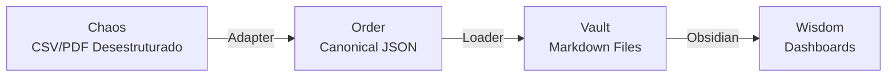

# Technical Documentation

## A Maquinaria de Stewardship

Para cumprir a promessa de "Soberania sem Dor", a arquitetura do **Finance Vault** esconde a complexidade do ETL (Extract, Transform, Load) em pipelines robustos, permitindo que o usuário foque apenas na entrada e saída.

### Fluxo de Dados (The Value Stream)

O dado viaja do caos (Extrato Bancário) para a ordem (Dashboard) em 3 estágios:

### Componentes do Pipeline

#### 1. Adapters (Sanitizers)

Binários que conhecem as idiossincrasias de cada banco.

- **Função:** "Traduzir" o dialeto do banco (ex: "Débito Nubank") para a Língua Franca do sistema.
- **Fail-Fast:** Se o banco mudar o CSV, o Adapter deve falhar com uma mensagem clara para o Steward: *"O arquivo X tem colunas novas. Verifique."*

#### 2. Sharding (Organization)

O sistema organiza os arquivos automaticamente usando metadados, não pastas manuais.

- **Path Strategy:** `vault/{shards.ledger}/{shards.owner}/{ano}/{mes}/{id}.md`
- **Por que?** Isso permite que múltiplos users (Casal) usem o mesmo vault sem colisão.

#### 3. Loam Engine (Persistence)

O [Loam](https://github.com/aretw0/loam) é o driver que garante:

- **Transacionalidade:** Ou grava tudo ou não grava nada.
- **Deduplicação:** Hash do conteúdo impede transações duplicadas.

## Camada de Visualização (The Garden)

Diferente de sistemas que exigem que você "crie relatórios", o Finance Vault **injeta** inteligência na leitura.

### Arquitetura Orientada a Propriedades

A visualização **NUNCA** deve depender de onde o arquivo está (pastas), mas sim do que ele **É** (metadados).

| Abordagem | Query | Por que usamos? |
| :--- | :--- | :--- |
| **Old (Frágil)** | `path:"finance"` | Quebra se você mover a nota. |
| **Stewardship (Robusto)** | `[shards.ledger: "pessoal"]` | Funciona em qualquer lugar do vault. |

### Stack Tecnológico

1. **Engine:** PowerShell Core (A "Cola" universal).
2. **Storage:** Markdown + Frontmatter (Longevidade > 50 anos).
3. **UI:** Obsidian (O Renderizador).
