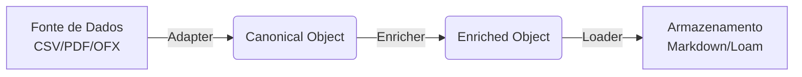

# Technical Documentation

## Arquitetura de Pipeline (Unix Philosophy)

O sistema segue estritamente a filosofia Unix de "Faça uma coisa e faça bem feito", implementada através de um **Pipeline de Processamento** modular.

### Fluxo de Dados

### Componentes

#### 1. Adapters (Source -> Canonical)

Scripts ou binários de *frente* que sabem ler formatos específicos (Nubank CSV, Sicoob PDF) e convertê-los para o **Canonical Transaction Schema**.

- **Responsabilidade:** Parsing, Normalização de Data/Moeda, Geração de ID.
- **Entrada:** Arquivo Bruto.
- **Saída:** Stream de Objetos JSON/PSCustomObject.

#### 2. Enrichers (Canonical -> Canonical)

Componentes opcionais intermediários que recebem uma transação canônica e adicionam informações.

- **Exemplos:** `Join-Category` (adiciona categoria baseada na descrição), `Filter-Date` (remove transações antigas).
- **Entrada/Saída:** Objeto Canônico.

#### 3. Loader (Canonical -> Storage)

O componente final que persiste o dado. É o único que interage com o **Loam**.

- **Responsabilidade:** Mapear o objeto para Frontmatter + Content, gerenciar caminhos, chamar `loam write`.
- **Entrada:** Objeto Canônico.
- **Saída:** Confirmação de I/O.

## Stack Tecnológico

- **Core Scripting**: PowerShell Core (`pwsh`). Escolhido pela facilidade de passar objetos estruturados no pipeline (`|`), evitando o parsing repetitivo de texto/JSON que seria necessário em Bash.
- **Storage Engine**: [Loam](https://github.com/aretw0/loam). Driver NoSQL para Markdown. Garante transacionalidade e abstrai o Git.
- **Formato de Dados**: Markdown com YAML Frontmatter.

## Portabilidade e Cross-Platform

Atualmente, a implementação foca em **PowerShell Core (`pwsh`)**, que é nativamente cross-platform (Windows, Linux, macOS).

- **Windows**: Suporte nativo.
- **Linux/macOS**: Requer instalação do `pwsh`.
- **Roadmap**: Avaliar migração para binários compilados (Go/Rust) ou scripts Bash caso a dependência do `pwsh` se torne um obstáculo para adoção em servidores minimalistas.

## Estratégia de Multi-Tenancy

Para suportar múltiplos usuários e contextos (`ledger`), a estrutura de diretórios e nomes de arquivo será determinante.

1. **Namespacing via Diretórios**:
    O `Loader` deve utilizar os campos `ledger` e `owner` para organizar os arquivos.
    - Padrão: `vault/{ledger}/{owner}/{ano}/{mes}/{id}.md`
    - Exemplo: `vault/familia/joao/2025/05/68136dee...md`

2. **Conflitos e Identidade**:
    - O `id` da transação deve ser único globalmente ou por banco. Ao usar Hash da transação, garantimos que se João e Maria importarem a mesma conta conjunta, o sistema detecta duplicidade (idempotência do `loam write`).
    - O `Loam` gerencia race conditions de escrita via Git.

## Decisões de Design

1. **PowerShell vs Bash/Python**:
   - Usamos PowerShell porque ele trafega **Objetos** no pipe, não texto. Isso elimina a necessidade de `jq` ou regex complexo entre cada etapa do pipeline.
   - Um adaptador retorna um objeto `.NET`, o enricher manipula propriedades desse objeto, e o loader lê essas propriedades.

2. **Loam como Driver**:
   - Não escrevemos arquivos `.md` manualmente. Delegamos ao `loam` para garantir que lockfiles, git operations e formatação sejam consistentes.
